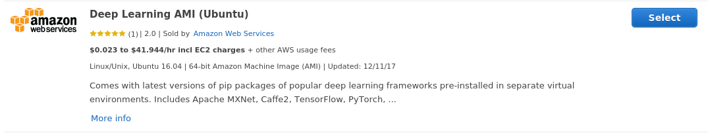

Setting up AWS EC2 Instance for Deep Learning with R and RStudio
================================================================

I worked through the
[instructions](https://tensorflow.rstudio.com/tools/cloud_gpu.html) for
setup of EC2 instance for deep learning that were listed in the R for
tensorflow website. Appendix B in [Deep Learning for
R](https://www.manning.com/books/deep-learning-with-r) also covers this.
However, I had to make some tweaks to get things working and so I wanted
to catalog what I did here (most of content below is same as the
instructions in RStudio website). I have noted explicitly where I had to
make some changes compared to instructions in the RStudio website.

### Pick an AMI in AWS Marketplace

There were two options listed for setting up EC2:

-   Using AWS Deep Learning AMI
-   Using Louis Aslett RStudio AMI

While, the Louis Aslett RStudio AMI already has R and RStudio installed,
I chose to set up using AWS Deep Learning AMI since I also wanted to
learn how to install R and RStudio.

The deep learning AMI I used, suggested in [Deep Learning for R
book](https://www.manning.com/books/deep-learning-with-r), is at
<https://aws.amazon.com/marketplace/pp/B077GCH38C>. I used this AMI on
p2.xlarge instance type.

*Note: The AMI suggested in RStudio instructions
<https://aws.amazon.com/marketplace/pp/B01M0AXXQB> didn't have apt-get
installed in it. Since I couldn't figure out how to install it (due to
my lack of familiarity with linux), I didn't use that AMI). *

### Installing R in the EC2 instance

SSH into the instance and execute the following commands. *Note: Prior
to installing R, we need to run the command to associate a CRAN mirror
so that the R install gets the latest version.*

    # Add cran mirror to /etc/apt/sources.list file to ensure installation of the latest version of R
    sudo /bin/bash -c 'echo "deb http://cran.rstudio.com/bin/linux/ubuntu xenial/" >> /etc/apt/sources.list'

    # install R
    sudo apt-get install r-base

After R installation, you can type R in the command prompt and if
everything worked right, you should be in a R session. You can quit the
session after checking this.

### Installing RStudio in the EC2 instance

    # Download RStudio Server and check MD5 sum
    wget https://download2.rstudio.org/rstudio-server-1.1.383-amd64.deb
    md5sum -c <<<"80cf85a6e0364a02a4e8d65f535dcc16 rstudio-server-1.1.383-amd64.deb"

    # Install RStudio Server
    sudo apt-get install gdebi
    sudo gdebi rstudio-server-1.1.383-amd64.deb

    # Configure RStudio to locate CUDA libraries
    CUDA="/usr/local/cuda-8.0/lib64:/usr/local/cuda-8.0/extras/CUPTI/lib64:/lib/nccl/cuda-8"
    sudo /bin/bash -c "echo 'rsession-ld-library-path=${CUDA}' >> /etc/rstudio/rserver.conf"

    # Note:  
    # Instructions site listed the following command
    # CUDA="/usr/local/cuda/lib64:/usr/local/cuda/extras/CUPTI/lib64"
    # However, I couldn't get it to work since the AMI has both CUDA-8 and CUDA-9 and the tensorflow environment
    # in the AMI uses CUDA-8. Hence I modified the command as shown above

    # Configure RStudio to not suspend sessions (prevent losing references to TF objects)
    sudo /bin/bash -c "echo 'session-timeout-minutes=0' >> /etc/rstudio/rsession.conf"

    # Add an interactive user for login to RStudio Server
    sudo adduser <username>

    # Restart RStudio with new settings
    sudo rstudio-server restart

Refer to SSH tunnel access and plain HTTP access in the
[instructions](https://tensorflow.rstudio.com/tools/cloud_gpu.html)
site.

### Running the Getting Started with Keras code

There are just a couple of more things I had to do before being able to
run the [getting started with
Keras](https://cran.r-project.org/web/packages/keras/vignettes/getting_started.html)
code. I installed keras using the `install.packages("keras")` command.
The AMI already has tensorflow and keras installed in conda
environments. I used the conda environment "tensorflow\_p36". Also,
anaconda is installed under /home/ubuntu. Since we are logging into
RStudio as a different user, we need to add the path to anaconda
(Otherwise, we will get an error with `use_condaenv` command that conda
binary was not found). So before running the code, I executed the
following 2 commands within the RStudio session

    # add anaconda3 in /home/ubuntu to current user PATH
    Sys.setenv(PATH=paste("/home/ubuntu/anaconda3/bin",Sys.getenv("PATH"),sep=":"))

    # Specificy tensorflow conda environment
    reticulate::use_condaenv("tensorflow_p36")

After this, I was able to run the getting started with Keras code.
